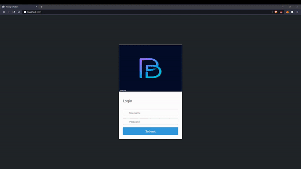
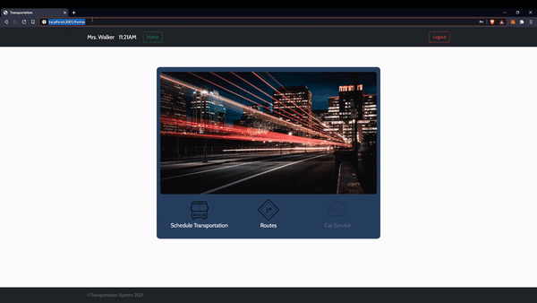

# Employee Transport System
SWE project

Project Description: Internal scheduling system for employees of a company with several offices near to each other within a certain area. Employees will be allowed to login, schedule routes and view the routes that occur during the day.

Front-end is built with HTML, CSS and JavaScript.
Back-end is built with Node.js and MongoDB. Modules used in this application are Express, EJS, EJS-Mate, Passport and Mongoose.

More features to come in application, including deployment.

              
